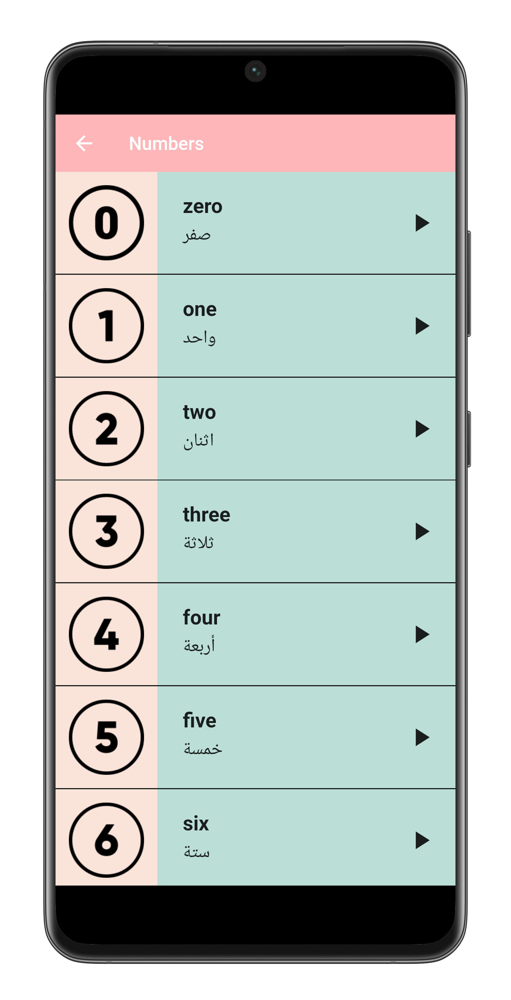
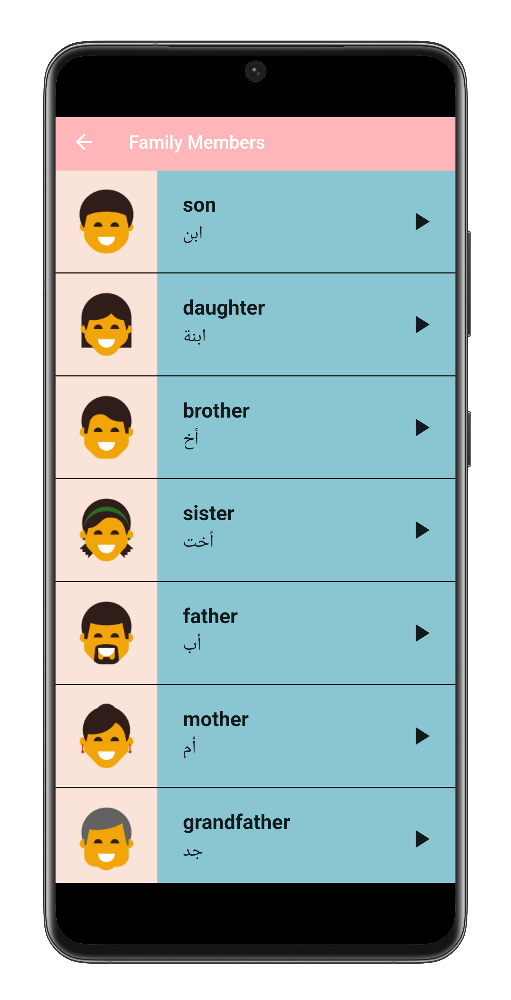
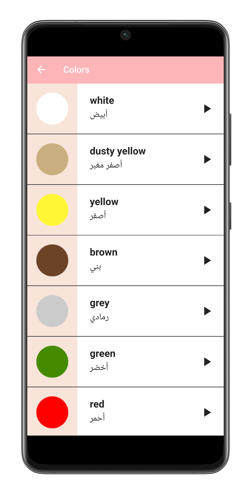
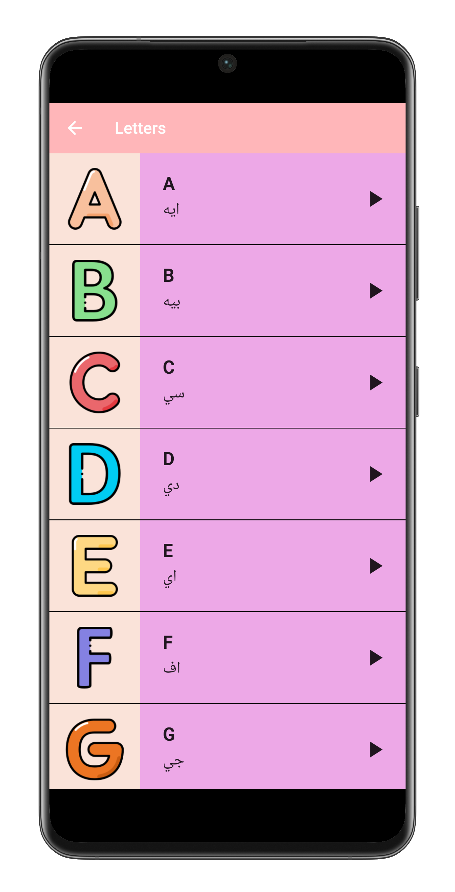

# 📚 See and Say App – English Learning for Kids🧒

**See and Say App** is an educational Flutter application designed to help kids learn English in a fun and engaging way.  
The app teaches basic vocabulary such as **colors, numbers, alphabets, and family members** using **pictures** and **audio pronunciation**, with support for **Arabic translations**.

---

## 🎯 Features

- 🔤 Learn the **English alphabets** (A-Z) with audio and images.
- 🌈 Learn **colors** with real-world images and pronunciation.
- 🔢 Practice **numbers** from 0 to 9 with voice support.
- 👨‍👩‍👧‍👦 Know the **family members** with Arabic explanation.
- 🗣️ Audio pronunciation for each word (English + Arabic).
- 🖼️ High-quality images for visual learning.
- 👶 Simple, child-friendly interface.
- 🌐 Fully localized content (English with Arabic guidance).

---

## 📸 Screenshots

| Home Screen | Numbers Section | Family Section | Colors Section | Alphabet Section |
|-------------|-----------------|----------------|----------------|------------------|
  |  |  |  |  

---

## 🚀 Getting Started

### To Clone the repository:
```bash
git clone https://github.com/yousef-mahmoud-2002/See-Say.git
